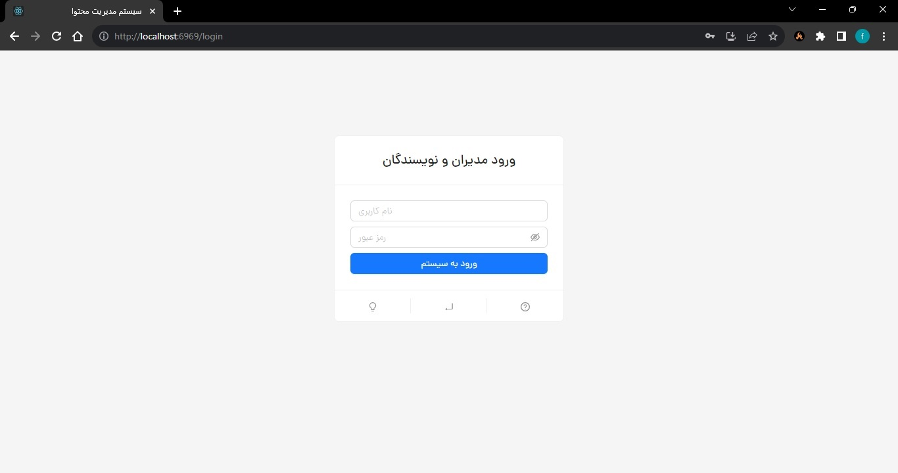
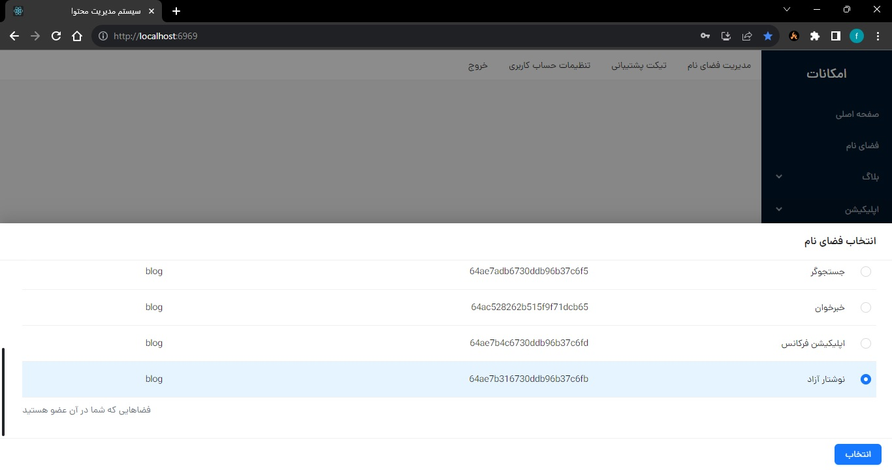
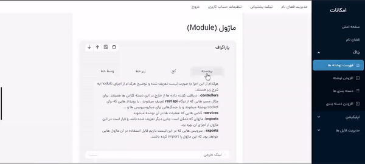
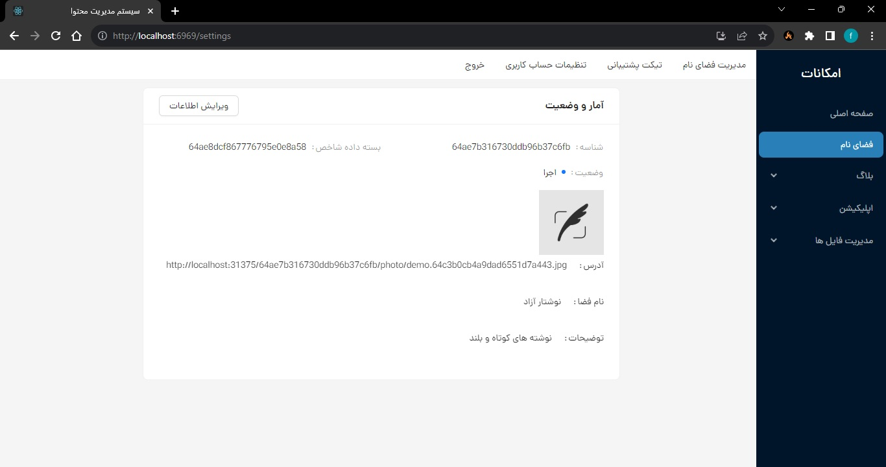
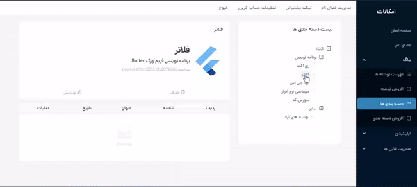
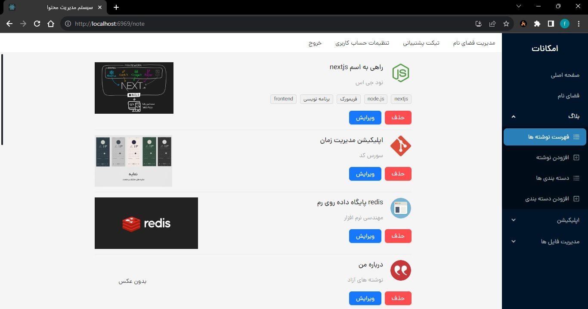
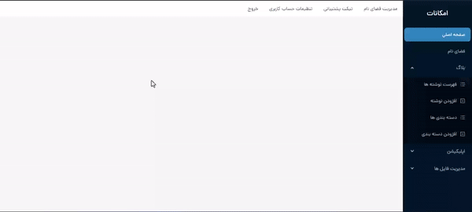
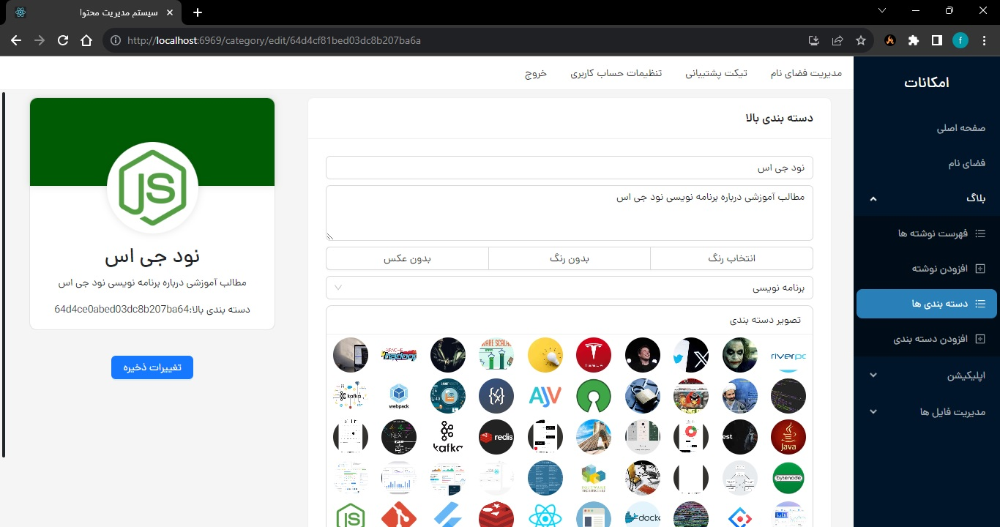

# Admin Panel For FCMS

this is an admin panel for fcms gui manager

Stacks

-   **React**: use react library and typescript for higher extensibility and readability
-   **Redux**: state management for data contolling for a page
-   **antd**: one of are most complete ui component library for react!

there is a `config.ts` file it can set server and cdn address

  
  
  
  
  
  
  
  
  

